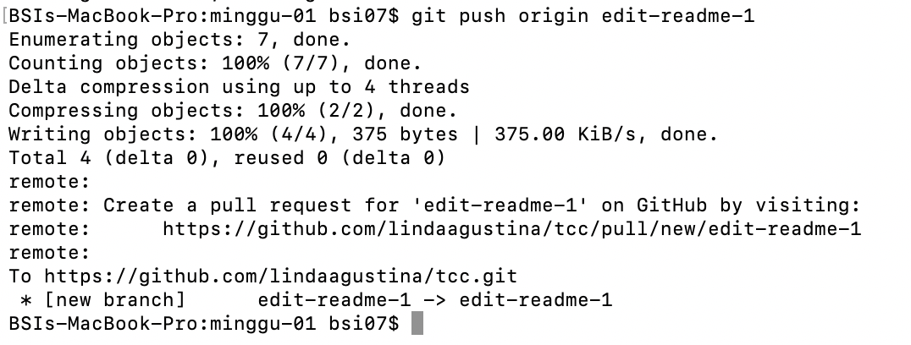
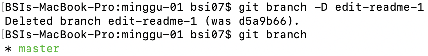

# Laporan Pertemuan 1 Praktikum Teknologi Cloud

1. Jika pada komputer yang digunakan sudah terdapat git, maka langsung saja mengetikkan perintah berikut untuk mengetahui git yang digunakan merupakan versi berapa.

2. Kemudian melakukan konfigurasi repository yang akan digunakan yaitu konfigurasi username dan password, isi sesuai akun github. Setelah melakukan konfigurasi tersebut, cek dengan mengetikkan perintah `git config --list` seperti di bawah ini.

3. Jika sudah melakukan langkah ke 2, lalu membuat repository di github. Klik tanda **+** pada bagian atas kanan setelah login, pilih **New repository**.

4. Isikan nama, lisensinya pilih **Public** agar dapat diakses secara publik dan centang pada **Initialize this repository with a README**, kemudian klik **Create Repository**.

5. Untuk memanipulasi konten pada lokal komputer, harus dilakukan clone repo terlebih dahulu untuk menduplikasi remote repo di Github ke komputer lokal. Perintahnya sebagai berikut, urlnya dapat dicopy pada bagian **Clone or download** di Github.

6. Setelah itu maka pada lokal komputer terdapat folder yang namanya sama dengan nama repository di Github, nah disitulah tempat dimana melakukan memanipulasi konten. Pindah ke direktori tersebut kemudian membuat direktori baru lalu didalamnya membuat file README.md.

7. Untuk melihat status pekerjaan yang dilakukan, bisa menggunakan perintah `git status`. Perintah tersebut menginformasikan kita berada di branch mana dan bagaimana status file yang ada di dalam folder tersebut.

8. Jika kita ingin melakukan push ke Github, maka harus menambahkan file yang akan dipush dengan perintah `git add -A` -A artinya menambahkan semua file yang ada, setelah ditambahkan harus di-commit dahulu, commit diperlukan untuk menyimpan perubahan yang dilakukan di lokal komputer, -m adalah perintah untuk memberikan pesan.

9. Kemudian push dengan perintah `git push origin master`, push digunakan untuk mengirim perubahan yang terjadi di lokal komputer ke repository, origin digunakan untuk mendeklarasikan branch yang akan digunakan. Kalau pertama kali melakukan push, maka diminta untuk mengisi username dan password akun Github.

10. Selanjutnya membuat branch baru dengan nama edit-readme-1 dan pindah ke branch tersebut dengan perintah `git checkout -b edit-readme-1`, -b digunakan untuk membuat branch baru.

11. Edit file README.md.

12. Cek posisi pekerjaan yang sudah dilakukan.

13. Menambahkan file yang sudah diedit, kemudian commit file tersebut.

14. Pindah ke branch master.

15. Push file tersebut ke branch edit-readme-1

16. Setelah melakukan push branch edit-readme-1, maka compare edit-readme-1 lalu tambahkan komentar di kolom Write kemudian klik **Create pull request**.

17. Kemudian merge branch tersebut ke branch master dengan klik **Merge pull request**.

18. Kemudian klik **Confirm merge**.

19. Merge di komputer local dengan perintah `git merge edit-readme-1`.

20. Delete branch edit-readme-1, untuk mengecek branch yang ada ketik perintah `git branch`.

21. `git pull` digunakan untuk melakukan sinkronisasi dari repository github ke komputer lokal.

