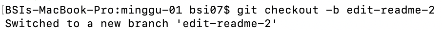
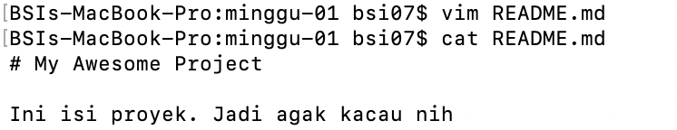
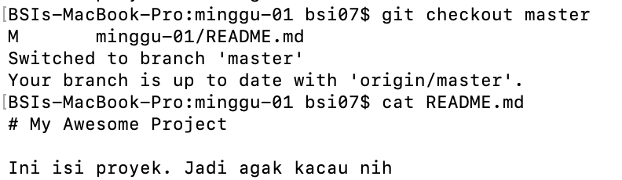
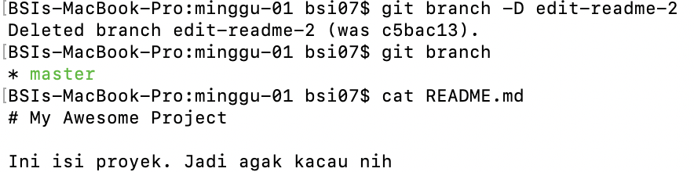
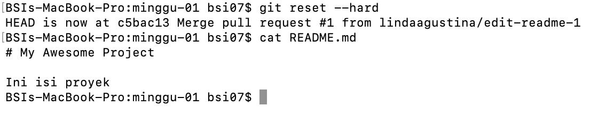

# Laporan Pertemuan 2 Praktikum Teknologi Cloud

Melanjutkan laporan yang pertama
1. Membuat branch baru dengan nama edit-readme-2, kemudian pindah ke branch tersebut.

2. Edit file README.md

3. Pindah ke branch master

4. Delete branch edit-readme-2

5. `git reset --hard` untuk membatalkan perubahan yang terjadi.
