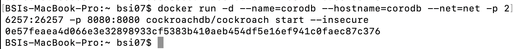
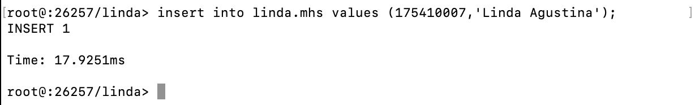

# Laporan Praktikum Pertemuan 5

Instalasi CockroachDB

1. Saya menggunakan docker sebagai environmennya, maka instal docker terlebih dahulu pada laptop.
2. Setelah instalasi docker selesai, membuka terminal.
3. Download image cockroachdb dengan perintah `docker pull cockroachdb/cockroach`

4. Membuat network dengan nama net menggunakan driver bridge.

5. Menjalankan image cockroachdb/cockroach dengan nama container corodb, hostnamenya corodb, container ini menggunakan network yang sebelumnya dibuat, berjalan pada port 8080 atau 26257, -d digunakan agar container berjalan pada background.

6. Untuk melihat container yang baru saja dijalankan, menggunakan perintah `docker ps -a`, -a digunakan untuk menampilkan semua container yang jalan.

7. Masuk ke dalam container corodb, menggunakan printah `docker exec -it corodb ./cockroach sql --insecure`.

8. Membuat database dengan nama linda.

9. Melihat database yang ada, dengan perintah `show databases;`.

10. Masuk ke dalam database linda, dengan printah `use linda;`.

11. Membuat table mhs di dalam database linda dengan field nim sebagai primary key dan nama.

12. Insert data ke dalam table mhs yaitu nim = 175410007 dan nama = Linda Agustina.

13. Menampilkan table mhs.

