# Laporan Praktikum Pertemuan ke 6 tentang Docker

Deploying Your First Docker Container
1. Mencari docker image dengan nama redis pada docker hub, dengan perintah `docker search redis`.
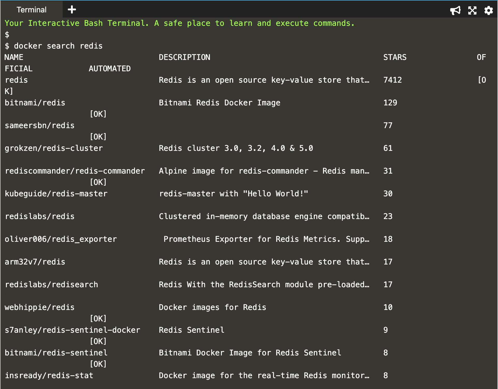
2. Kemudian menjalankan image redis tersebut, dengan perintah `docker run -d redis`, -d digunakan agar image redis berjalan pada background.
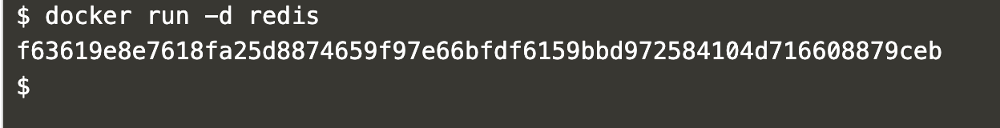
3. Melihat container yang sudah running, dengan perintah `docker ps`.
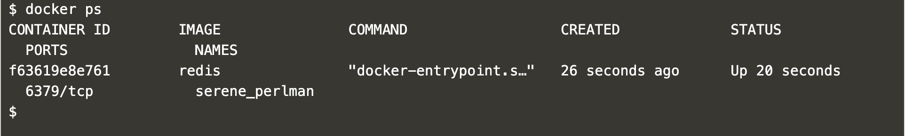
4. Untuk melihat detail dari suatu container seperti IP Address, digunakan perintah `docker inspect (nama dari container / id container)`.
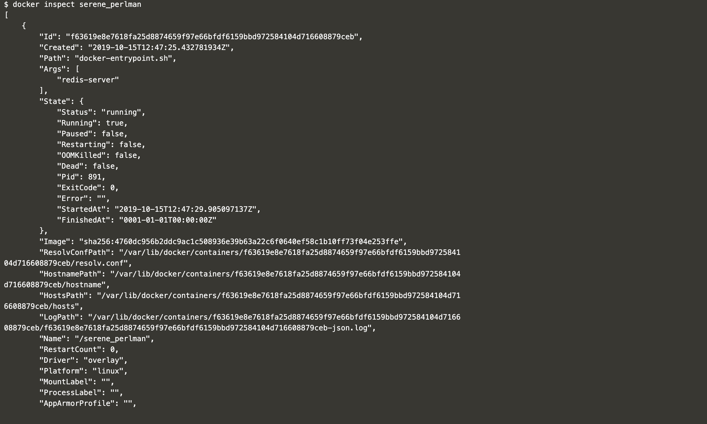
5. Untuk melihat log dari sebuah container yang running, digunakan perintah `docker logs (nama dari container / id container)`.
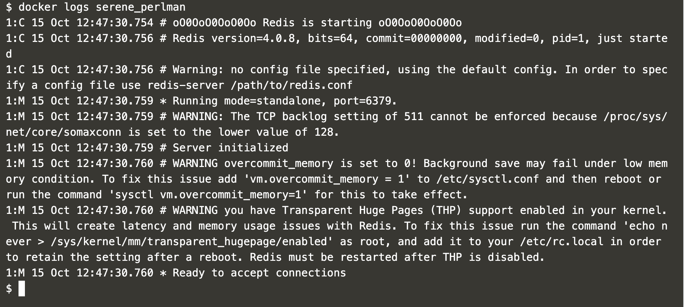
6. Perintah di bawah ini digunakan untuk menjalankan image redis:latest pada background dengan nama redisHostPort yang dapat diakses menggunakan port 6379.
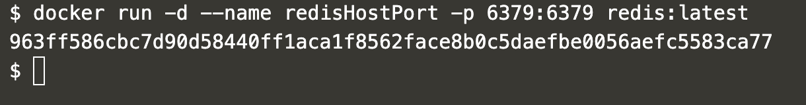
7. Sama dengan nomer 6 hanya saja namanya adalah redisDynamic.
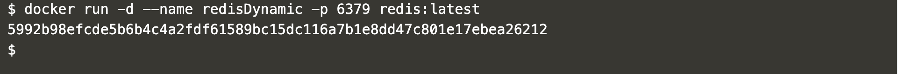
8. Untuk melihat daftar mapping port, digunakan perintah `docker port (nama container) (port container)`.
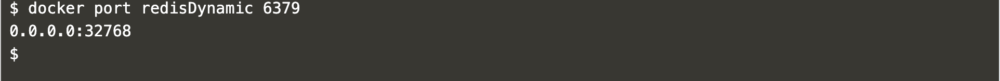
9. Ketikkan `docker ps`, dapat melihat list container yang jalan.
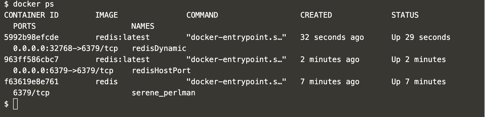
10. Perintah di bawah ini, digunakan untuk menjalankan image yang disertai dengan persisten volume.
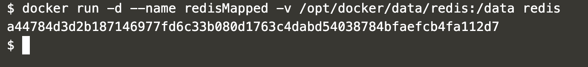
11. Perintah di bawah ini digunakan untuk menjalankan container ubuntu dengan command ps.
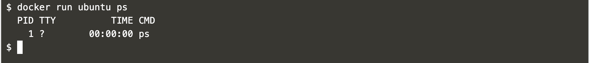
12. Perintah di bawah ini digunakan untuk masuk ke dalam container ubuntu.
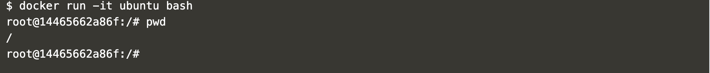
