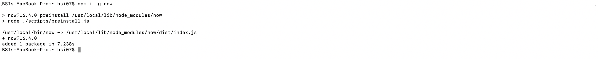
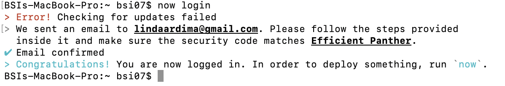
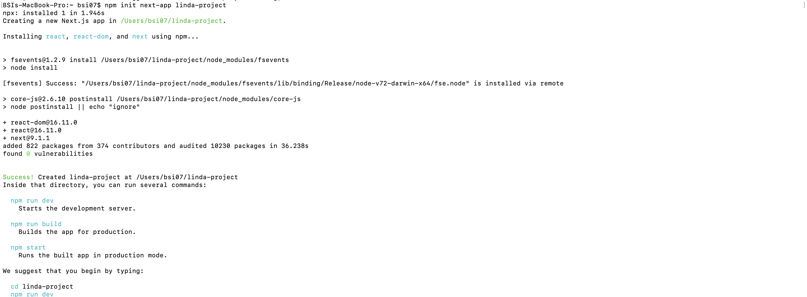
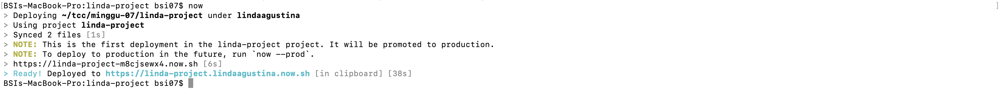
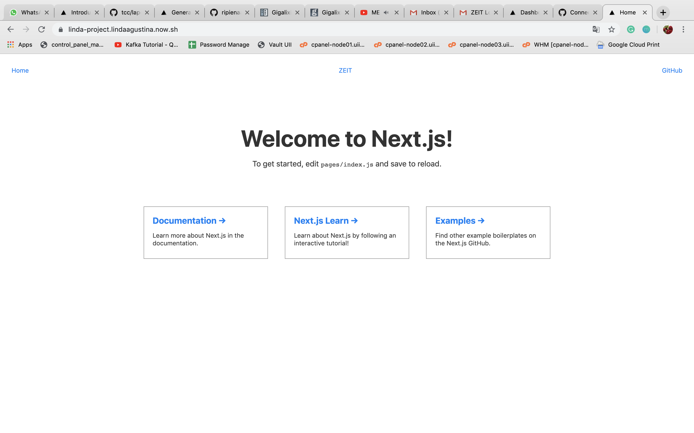

# Laporan Pertemuan 7 tentang ZEIT Now

1. Install npm terlebih dulu, karena command ini akan digunakan untuk install ZEIT Now.
2. Install Now CLI menggunakan npm, dengan perintah `npm i -g now`.

3. Login ke ZEIT Now menggunakan printah `now login`, kemudian akan dimintai menginputkan email. Jika belum memiliki akun ZEIT Now, maka mendaftar terlebih dulu. Jika sudah memiliki akun, akan dilakukan verifikasi email setelah menginputkan email.

4. Membuat dan deploy sebuah project menggunakan Next.js, project yang saya buat saya beri nama linda-project.

5. Setelah selesai dibuat, pindah ke direktori linda-project dengan perintah `cd linda-project`.
6. Deploy applikasinya dengan perintah `now`.

7. Hasil dari aplikasi tersebut dapat diakses pada URL https://linda-project.lindaagustina.now.sh/.

