# Laporan 09

Laporan pertemuan 9 sudah diselesaikan sebelumnya di pertemuan minggu ke 8.

# Laporan 10

1. Login GitHub.
2. Masuk ke repo yang ingin kita fork `https://github.com/shafirakp/tcc-1.git`.
3. Klik tombol fork.
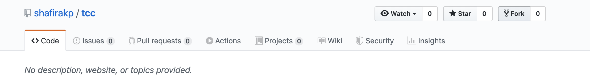
4. Setelah klik fork, maka button fork akan ke disable.
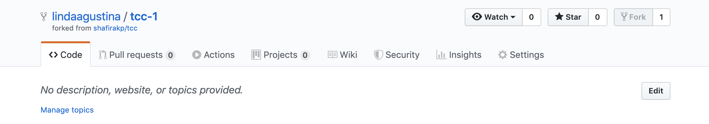
5. Clone repo yang sudah kita fork menggunakan perintah `git clone https://github.com/lindaagustina/tcc-1.git`.
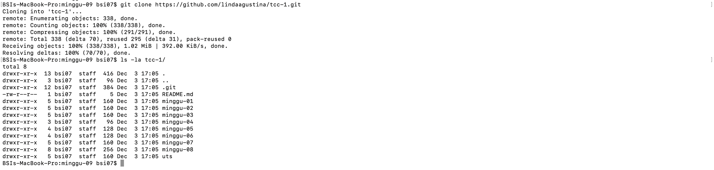
6. `git remote -v` dilakukan untuk melihat track repository.
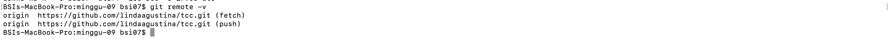
7. Membuat konfigurasi repo upstream.
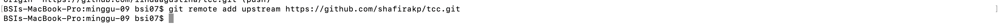
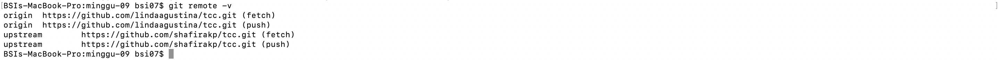
8. Mengubah isi file README.md.
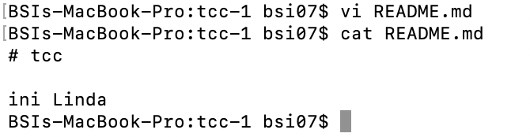
9. Commit file yang telah diubah.
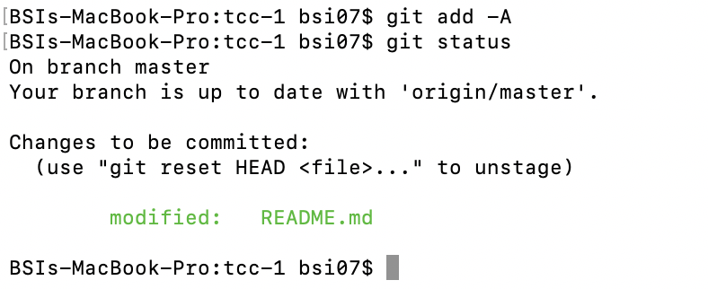
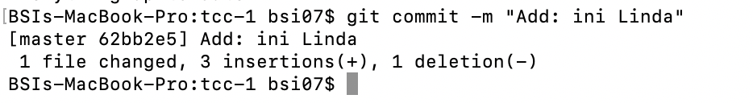
10. New Pull Request
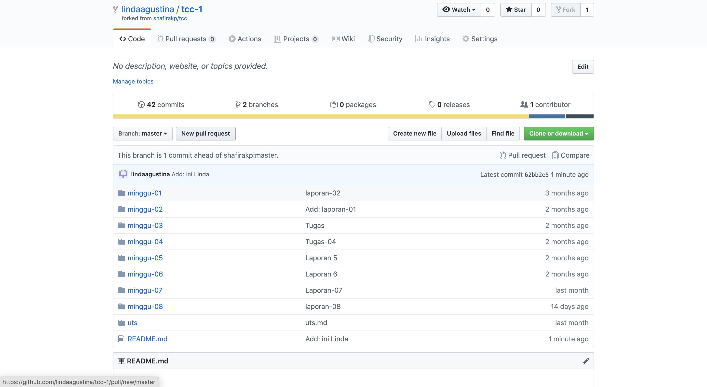
11. Create Pull Request
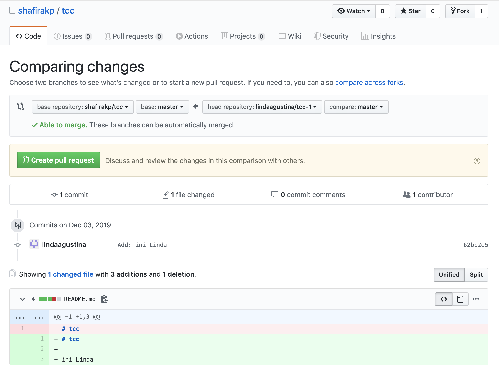
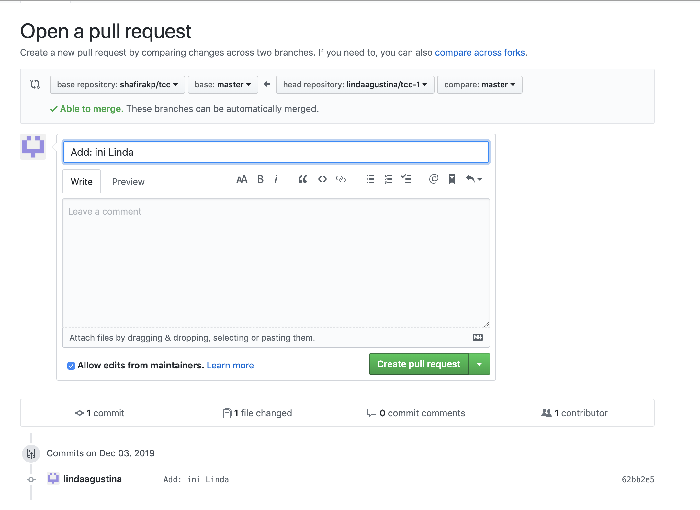
12. Success
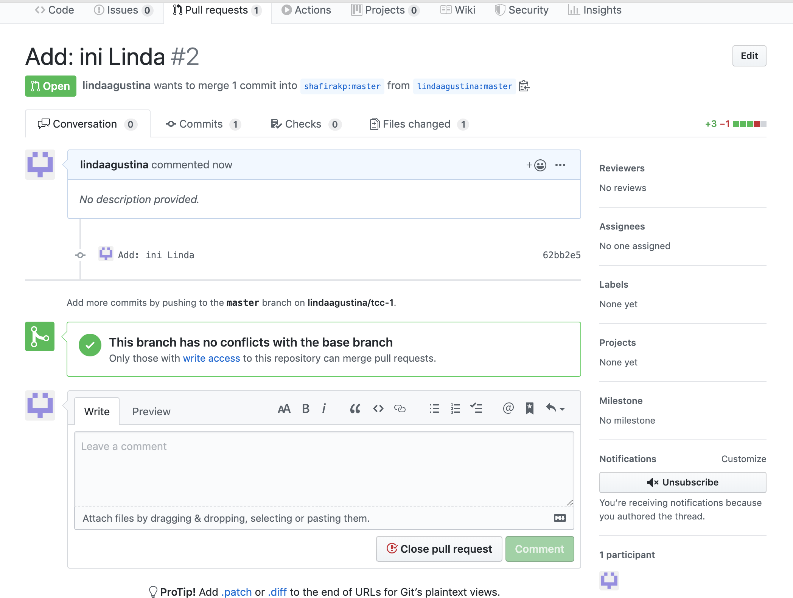
