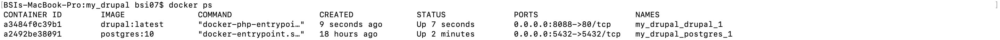

# Instalasi Drupal menggunakan Docker Compose

1. Membuat direktori my_drupal, kemudian pindah ke direktori tersebut.

2. Membuat file docker-compoe.yml, di dalam file tersebut akan membuat 2 container yaitu drupal menggunakan image drupal:latest dan postgres menggunakan image postgres:10, drupal dapat diakses menggunakan port 8088 dan drupal menggunakan port 5432. Terdapat volumes, ini digunakan agar file yang ada dalam direktori tersebut tidak hilang saat container restart. Terdapat environment untuk mendefinisikan password dari postgres.

3. Menjalankan perintah `docker-compose up -d` untuk menjalankan file docker-compose.yml, -d digunakan agar proses berjalan pada background.

4. Setelah proses selesai, dapat dilihat containernya menggunakan perintah `docker ps`

5. Kemudian akses drupal pada URL http://127.0.0.1:8088 untuk proses instalasi, pertama yaitu pilih bahasa yang digunakan.

6. Memilih profil instalasi

7. Konfigurasi database

8. Proses instalasi

9. Konfigurasi site

10. Proses selesai, dan muncul tampilan awal drupal.

