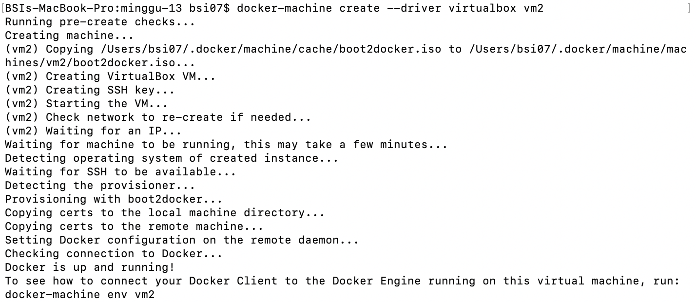
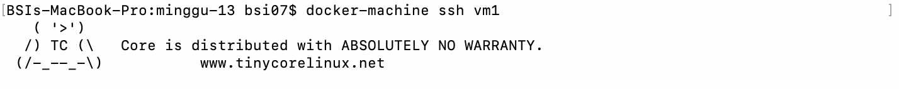
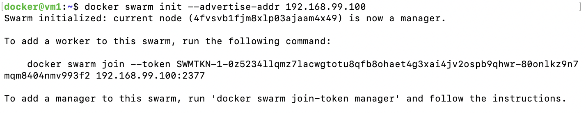
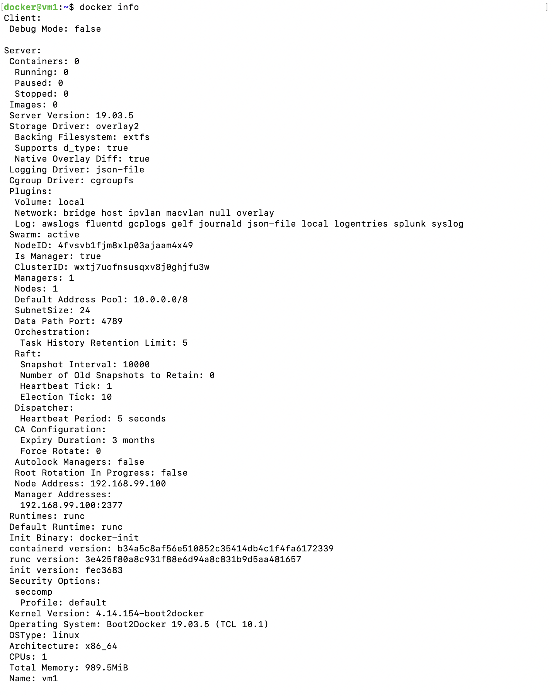
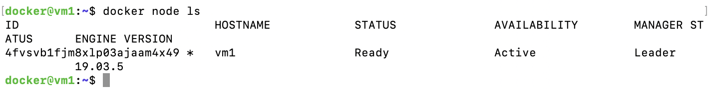
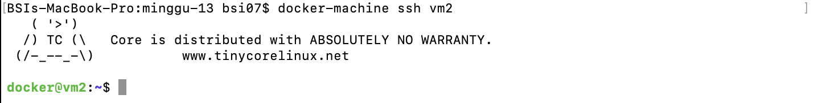
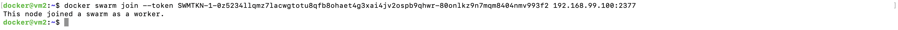
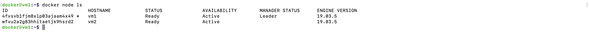

# Docker Swarm

1. Membuat VMs dengan nama vm1 dan vm2 menggunakan docker-machine menggunakan perintah `docker-machine create --driver virtualbox vm1`.

2. Perintahkan vm1 menjadi swarm manager dengan ssh ke mesin vm1 kemudian menjalankan perintah `docker swarm init --advertise-addr 192.168.99.100`.

3. `docker info` untuk melihat status pada swarm.

4. `docker node ls` perintah untuk melihat informasi tentang node.

5. Ssh ke mesin vm2

6. Join vm2 ke swarm vm1 dengan perintah `docker swarm join --token (token). 192.168.99.100:2377`

7. Connect ke vm1, kemudian jalankan perintah `docker node ls`.

