# UTS

**Pengertian Docker**

Docker adalah sebuah proyek yang bersifat open source dibawah lisensi Apache Versi 2.0 yang bisa dipergunakan secara gratis oleh developer dan berfungsi sebagai wadah atau container untuk memasukkan sebuah aplikasi secara lengkap beserta semua hal lainnya yang dibutuhkan sehingga dapat berjalan dimana saja.
Dalam hal ini, developer atau sysadmin dapat menjalankan aplikasi di mana pun misalnya di laptop, data center, virtual machine dan cloud.
Docker adalah salah satu platform yang dibangun berdasarkan teknologi container.
Docker merupakan sebuah project open-source yang menyediakan platform terbuka untuk developer maupun sysadmin untuk dapat membangun, mengemas, dan menjalankan aplikasi dimanapun sebagai sebuah wadah (container) yang ringan.

**Pengertian PaaS**

Platform as a service (PaaS) adalah kategori layanan komputasi cloud yang menyediakan platform yang memungkinkan pelanggan untuk mengembangkan, menjalankan, dan mengelola aplikasi tanpa kompleksitas membangun dan memelihara infrastruktur yang biasanya terkait dengan pengembangan dan peluncuran aplikasi.
PaaS dapat disampaikan dalam dua cara :
sebagai publik layanan cloud dari penyedia, di mana konsumen kontrol penyebaran perangkat lunak dengan sedikit pilihan konfigurasi, dan provider yang menyediakan jaringan, server, penyimpanan, OS, 'middleware' (yaitu; java runtime, .net runtime, integrasi, dll.), database dan layanan lainnya untuk menjadi tuan rumah konsumen aplikasi,
atau sebagai layanan pribadi (perangkat lunak atau alat) di dalam firewall, atau sebagai perangkat lunak yang digunakan pada public infrastructure as a service.

**Pengertian SaaS**

SaaS (software as a service atau perangkat lunak berbentuk layanan) adalah suatu model penyampaian aplikasi perangkat lunak oleh suatu vendor perangkat lunak yang mengembangkan aplikasi web yang diinangi dan dioperasikan (baik secara mandiri maupun melalui pihak ketiga) untuk digunakan oleh pelanggannya melalui Internet.
Pelanggan tidak mengeluarkan uang untuk memiliki perangkat lunak tersebut melainkan hanya untuk menggunakan. Pelanggan menggunakan perangkat lunak tersebut melalui antarmuka pemrograman aplikasi yang dapat diakses melalui web dan seringkali ditulis menggunakan layanan web atau REST.

**Keterkaitan antara Docker, PaaS dan SaaS**

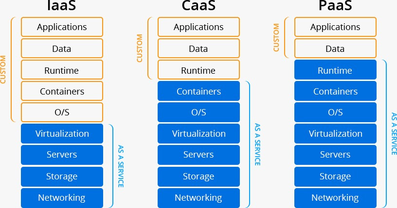

**Upload Images to Docker Hub**

1. Masuk ke direktori tcc.
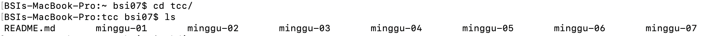
2. Kemudian membuat direktori dengan nama UTS, lalu pindah ke direktori tersebut. Kemudian membuat file Dockerfile, Dockerfile adalah suatu dokumen yang berisi perintah-perintah yang diperlukan untuk membuat suatu images.
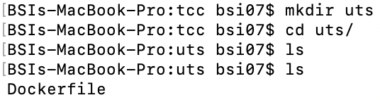
3. Dockerfile tersebut menggunakan base image nginx:alpine. Dockerfile ini dapat diakses menggunakan GitHub pada URL https://github.com/lindaagustina/tcc/blob/master/uts/Dockerfile.
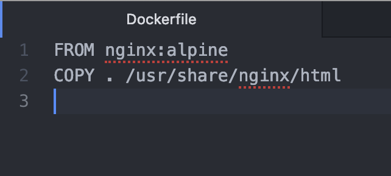
4. Membuat image nginx menggunakan file Dockerfile tersebut, dengan perintah `docker build -t (nama-image:tag) .` titik (.) digunakan untuk medeklarasikan bahwa Dockerfile yang akan digunakan terdapat pada direktori tersebut.
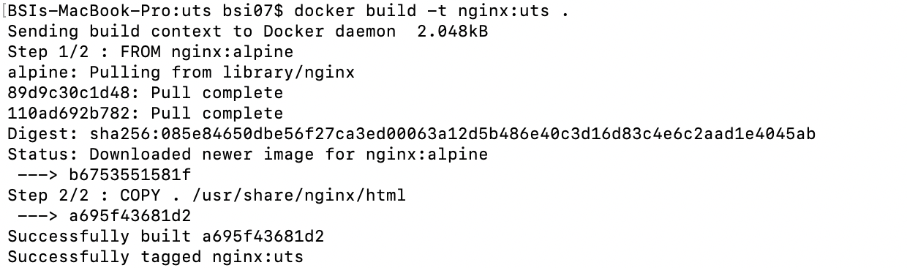
5. Untuk melihat hasil docker image yang telah dibuat menggunakan perintah `docker images`.
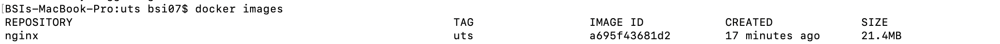
6. Sebelum meng-upload docker images ke Docker Hub, harus login ke Docker Hub terlebih dahulu, dengan perintah `docker login`. Kemudian menginputkan username dan password Docker Hub.

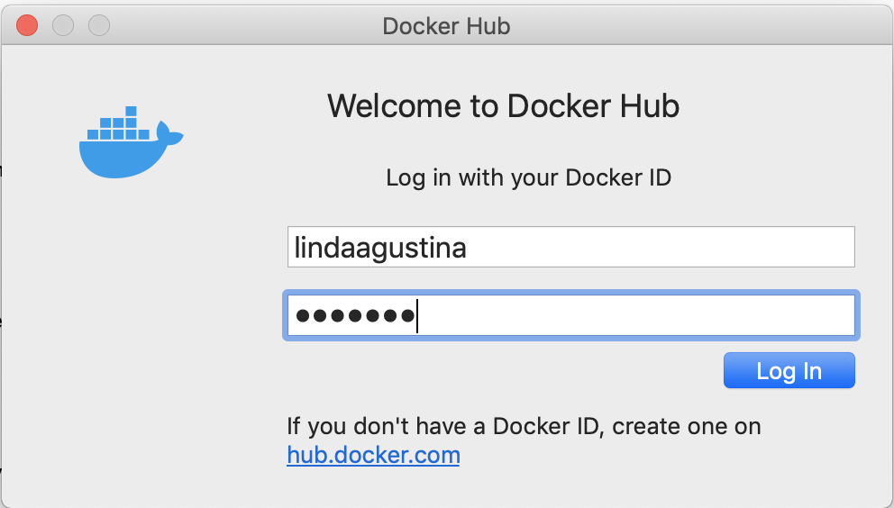
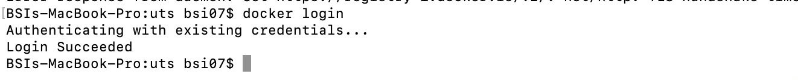
7. Docker image yang akan di-push ke Docker Hub, harus diganti nama image-nya menggunakan lindaagustina/nginx:uts, lindaagustina merupakan username Docker Hub, nginx merupakan aplikasinya dan uts merupakan tag yang dibuat. Penggunaan username, agar saat image di-push akan tertuju pada Docker Hub kita.
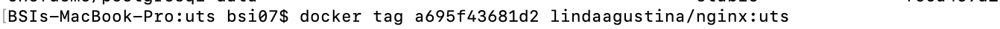
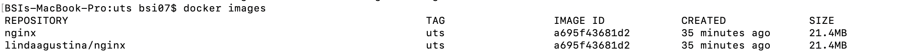
8. Upload docker image yang sudah diganti taggingnya, menggunakan perintah `docker push lindaagustina/nginx:uts`.

9. Jika sudah berhasil dipush, maka akan muncul images yang telah dipush pada Docker Hub kita. Jika ingin mengakses images nginx tersebut dapat diakses melalui URL berikut https://hub.docker.com/r/lindaagustina/nginx/tags.
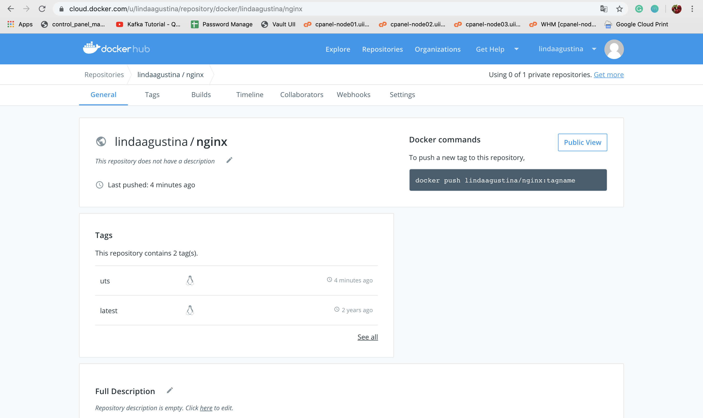
10. Docker images adalah sebuah template yang bersifat read only. Template ini sebenarnya adalah sebuah OS yang telah diinstall berbagai aplikasi. Docker images berfungsi untuk membuat docker container, menggunakan 1 docker images kita dapat membuat banyak docker container.
11. Menjalankan docker images agar menjadi sebuah container dengan perintah docker run -d -p 8080:80 --name=linda-nginx lindaagustina/nginx:uts yang artinya akan menjalankan docker container pada port 8080 (browser), dan docker akan mengarahkan ke service port 80 pada container dengan nama linda-nginx.
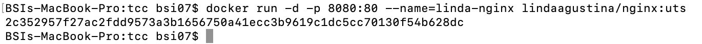
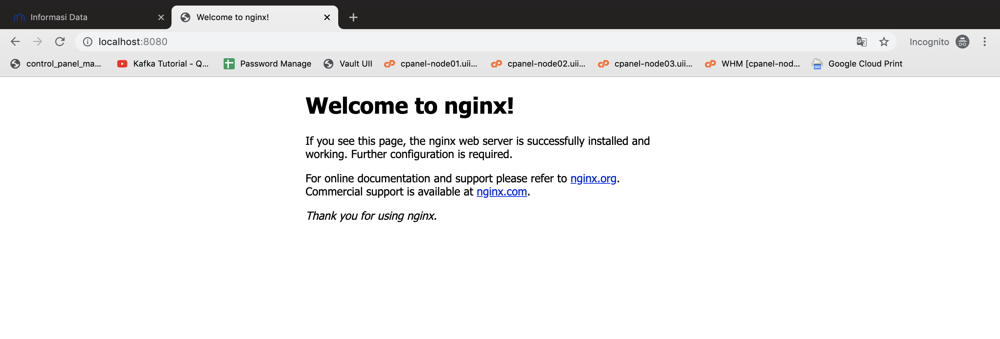
